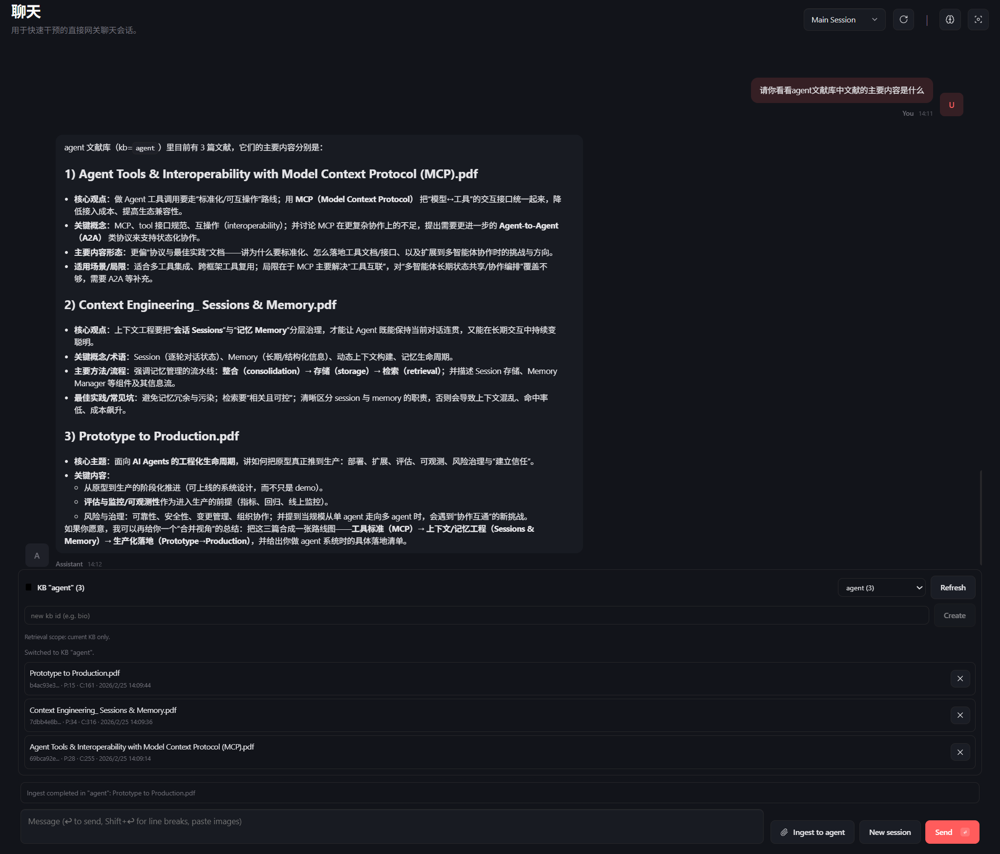

# Agentic RAG Service



演示视频：[`点击观看`](https://www.bilibili.com/video/BV131f4BCEdM/?spm_id_from=333.1387.upload.video_card.click&vd_source=ea2e425b8f3061b1a7884cf3620c1d62)

该界面已接入本项目 RAG Service，支持：
- 拖拽 PDF/Markdown 入库（异步任务化）
- 多知识库（KB）切换与问答
- 检索问答与引用追溯（`retrieve + ask + resolve_refs`）
- 文档管理与索引维护（列表、删除、重建）

Agentic RAG Service 是一个面向 Agent 场景的 RAG 引擎：从文档切分、混合检索、证据约束回答到引用解析，形成完整的检索问答闭环。项目支持多知识库、异步入库，并提供稳定的 API 契约，可快速接入 OpenClaw 等工具调用框架。

## RAG 核心能力

### 1) 分层切分（Parent/Child）

文档入库不是单层 chunk，而是两层结构：

- Parent chunk：按 Markdown 标题切分后，再做“合并过小块 + 拆分过大块 + 清理尾小块”
- Child chunk：在 Parent 基础上做细粒度递归切分（用于向量检索）

这样做的目的：
- 检索阶段用 Child 提高召回精度
- 回溯阶段保留 Parent 级语义完整性与可读性

当前关键参数（可调）：
- `CHILD_CHUNK_SIZE=500`
- `CHILD_CHUNK_OVERLAP=100`
- `MIN_PARENT_SIZE=2000`
- `MAX_PARENT_SIZE=4000`

### 2) 混合检索（Hybrid Retrieval）

检索层使用 Qdrant Hybrid 模式：

- Dense：`sentence-transformers/all-mpnet-base-v2`
- Sparse：`Qdrant/bm25`

检索策略包括：
- `score_threshold` 门限控制
- `source_names` 文献级过滤
- 过滤场景下自动扩大候选池（`top_k * 5`，上限 200），降低误过滤造成的召回损失
- 多级 fallback（带分数检索失败时回退到无分数检索）

### 3) `ask`：证据约束回答（核心亮点）

`ask` 不是“把检索结果拼给 LLM”的普通模式，而是受证据约束的回答流程：

1. 先执行 `retrieve` 得到候选 `ref_id + chunk_text`
2. 将“允许引用的 ref_id 列表”与上下文一起给 LLM
3. 强约束 LLM 输出结构化结果：`answer + used_refs`
4. 服务端校验 `used_refs`，仅保留候选集合中的合法引用
5. 再将 `used_refs` 解析为 citations 返回

这意味着：
- 模型回答与证据显式绑定
- 非法引用会被服务端过滤
- 无命中时返回保守回答（而不是强行编造）

### 4) 延迟引用绑定（Delayed Citation Binding）

系统将“回答生成”和“引用展示”解耦：

- 检索/问答阶段只使用最小上下文
- 展示阶段才调用 `resolve_refs` 解析 `source_name/document_id/parent_id/page_hint/snippet`

收益：
- 减少 metadata 对 LLM 的污染
- 引用链条可审计、可追溯、可单独优化

### 5) 多知识库隔离

- 所有核心操作显式携带 `kb_id`
- 每个 KB 独立 collection、文档目录、父块存储与索引元数据
- 支持在 KB 内继续按 `source_names` 精细化限制检索范围

## 端到端 RAG 流程

### 入库流程

1. 上传来源：`file_path` / `base64_file` / `text`
2. PDF 转 Markdown（或直接使用 Markdown）
3. Parent/Child 分层切分
4. Child 写入 Qdrant，Parent 写入本地 ParentStore
5. 文档元信息写入 DocumentIndex

### 问答流程

1. `retrieve(query)` 返回候选片段
2. `ask(question)` 在受限证据集上生成 `answer + used_refs`
3. `resolve_refs(used_refs)` 解析可展示 citations
4. 返回答案、引用和调试统计

## 与普通 RAG 的关键差异

- 不是“仅返回相似片段”，而是“证据约束生成 + 引用校验”
- 不是“metadata 全量入模”，而是“最小上下文 + 延迟引用解析”
- 不是“单库混放”，而是“多 KB 一等公民 + 文献级过滤”
- 不是“同步阻塞入库”，而是“异步任务化索引流程”

## 集成与调用体验（OpenClaw / Tool Calling）

这个项目的设计目标之一是“低成本集成”：外部系统无需耦合内部检索实现，只需按 HTTP 接口调用即可完成建库、入库、检索、问答、引用解析、重建索引等全流程。

在 OpenClaw 中可直接映射为工具集：

- 库与文档：`rag_list_kb`、`rag_create_kb`、`rag_list_documents`
- 入库与维护：`rag_ingest`、`rag_ingest_local_file`、`rag_reindex`、`rag_delete_document`
- 检索问答：`rag_retrieve`、`rag_ask`
- 任务与引用：`rag_task_status`、`rag_resolve_refs`

这使得 Agent 可以在一个统一工作流中完成：上传文献 -> 检索证据 -> 生成回答 -> 回溯引用，而无需额外胶水层。

## 主要接口（简要）

- `POST /v1/kb/{kb_id}/documents`：异步入库
- `GET /v1/tasks/{task_id}`：任务状态
- `POST /v1/kb/{kb_id}/retrieve`：检索
- `POST /v1/kb/{kb_id}/ask`：证据约束问答
- `POST /v1/kb/{kb_id}/resolve_refs`：引用解析
- `POST /v1/kb/{kb_id}/reindex`：重建索引
- `GET /v1/kb/{kb_id}/documents`：文档列表

更多示例见 `project/API_README.md`。

## 快速启动

### 本地

```bash
cd project
export RAG_API_TOKEN="replace-with-strong-token"
python3 api_server.py
```

默认地址：`http://127.0.0.1:8099`

### Docker（API + Ollama）

```bash
cd /home/test/workspace/agentic_rag_service
docker build -f Dockerfile.api-ollama -t rag-api-ollama:local .

docker run -d --name rag-api-ollama --restart unless-stopped \
  --gpus all \
  -p 8099:8099 \
  -e RAG_API_TOKEN=rag-dev-token-123 \
  -e RAG_DATA_ROOT=/data \
  -v /home/test/workspace/agentic_rag_service/.data:/data \
  rag-api-ollama:local
```

健康检查：

```bash
curl -sS http://127.0.0.1:8099/healthz \
  -H "Authorization: Bearer rag-dev-token-123"
```

## 关键可调参数（RAG 调优）

- 召回范围：`top_k`
- 召回阈值：`score_threshold`
- 上下文片段数：`max_context_parents`
- 文献过滤：`source_names`
- Chunk 策略：`CHILD_CHUNK_SIZE / OVERLAP / MIN_PARENT_SIZE / MAX_PARENT_SIZE`

## 项目结构

```text
project/
  document_chunker.py      # 分层切分策略
  services/rag_service.py  # 检索、ask、引用解析主链路
  services/task_manager.py # 异步任务队列
  db/vector_db_manager.py  # Qdrant Hybrid 检索
  db/parent_store_manager.py
  db/document_index_manager.py
  api_server.py            # HTTP 服务入口
  api/schemas.py           # 请求模型
```

## License

MIT
